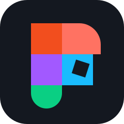

# Figlo

Import your Figma designs into Roblox Studio as editable UI.

Text stays editable. Simple shapes use Roblox UI objects. Artwork that needs
rasterization is uploaded as images. You can also add button effects, animation
and page navigation with [layer tags](docs/effects.md).

Figlo is in alpha. Expect differences in fonts, masks and clipping; check the
[compatibility guide](docs/compatibility.md) before importing a large design.

## Install

You need Figma desktop, Roblox Studio and [Bun 1.3.10](https://bun.sh).
Download the Figma plugin ZIP, Studio `.rbxm` and source ZIP from
[Releases](https://github.com/astrorehan/figlo/releases).

1. Extract the source ZIP. Open a terminal in that folder and run `bun run relay`.
   Keep it running while you use Figlo.
2. Extract the Figma plugin ZIP. In Figma, choose **Plugins > Development > Import
   plugin from manifest** and select its `manifest.json`.
3. Copy the Studio `.rbxm` into your local Plugins folder, then restart Studio.
   Studio's **Plugins Folder** command opens that folder.
4. Enable **Allow HTTP Requests** in your place. Open Figlo in both apps and paste
   the pairing token printed by the relay into each panel. Allow the permissions
   requested by the Studio plugin.

Image uploads need the relevant permissions on your Roblox account.
See [installation](docs/install.md) for folder locations and
[troubleshooting](docs/troubleshooting.md) if something fails.

## Import a frame

Select a frame in Figma and click **Export to Roblox**. Copy the six-character
code into Figlo in Studio and click **Import**.

The result appears under `StarterGui` as `Figlo_<frame name>`. Check it in Play
and save your place. To try Figlo first, click **Create demo frame** in the Figma
plugin. [Demo preview](docs/demo.svg).

Select a panel and open **Tag Guide** to interact with its UI. Each child uses its
own tags: a `Buy_button_smooth` responds to hover and press, while an untagged shop
frame stays still. Navigation tags can open, close or switch layers inside that
frame. **Maximize** opens the preview across a larger plugin window; **Esc** returns
to the guide. The preview has a faint dotted background.

Adding tags is optional. Open **Edit layer tags** and choose a child to see its
tags and settings while keeping the whole panel selected. Changes preview on
that child; **Save settings** keeps them in Figma. You can also add or remove
tags there. Browsing the guide does not change your layers.

Restarting the relay changes its pairing token unless you set `FIGLO_TOKEN`.
Paste the new token into both panels. The token is private; the export code is
a separate value.

## Using AI

You can ask your AI client to import a frame for you:

> Import this Figma frame into my Roblox Studio place using Figlo: <frame URL>.

Your client needs browser access to the Figma editor, a shell to run Figlo's
export tools, and Studio MCP to call the importer. With those connections and
Figlo's modules already set up, it can export the frame, send it to the local
relay, import it in Studio and check the result without you clicking the plugin
buttons or copying an export code.

This workflow was used with the earlier FrameFig version; it hasn't been
repeated end to end with the current relay, which also needs the pairing token.
CLI clients work too, as long as they have all three connections.

See [the automation guide](docs/studio-mcp.md) for the commands, importer call
and status checks. Headless Chrome hasn't been tested. The direct importer
doesn't create the plugin's Undo recording, so a failed import isn't rolled back
the way it is from the panel.

## Update an existing import

Export the same Figma frame again and import its new code. Figlo finds the
previous import, even if you renamed the ScreenGui. It keeps the ScreenGui
settings, root placement and visibility, and effect values you changed in Studio.

Children you added **inside the imported root** are replaced. Keep custom objects
outside that root. The previous root is backed up in `ServerStorage.FigloBackups`.
Undo can restore place edits; it cannot undo image uploads to Roblox.

To add a page, select a Figlo ScreenGui and choose **Import as page**. Pages share
a runtime, and additional pages start hidden. Use tags such as `_goto:Details`
for navigation.

## Where your data goes

The relay runs on your computer. There is no hosted relay or telemetry.
Exports are stored locally for up to seven days. Images used by an import are
uploaded to Roblox and follow its ownership and moderation rules.

Keep the pairing token private and use designs and assets you have permission
to use. [Relay settings, limits and export deletion](docs/relay.md).

## Build from source

Install Bun 1.3.10 and [Rokit 1.2.0](https://github.com/rojo-rbx/rokit), then run:

```sh
rokit install
bun run check
bun run build
```

The Studio plugin is written to `build/Figlo.rbxm`; the Figma plugin is built in
`figma/plugin`. Rojo and Lune versions are pinned in `rokit.toml`.

Edit workspace files and sync through Rojo or Argon. For custom integrations,
see the [importer and runtime API](docs/api.md). For tests, packaging and the
remaining visual checks, see [release verification](docs/release.md).

[Contributing](CONTRIBUTING.md) · [Security](SECURITY.md) · [Changelog](CHANGELOG.md)

MIT licensed. See [LICENSE](LICENSE) and [third-party notices](THIRD_PARTY_NOTICES.md).
Figlo is an independent project, not affiliated with Figma or Roblox.
